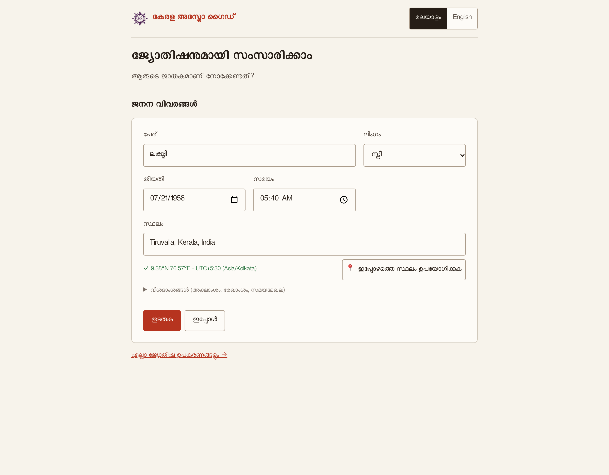
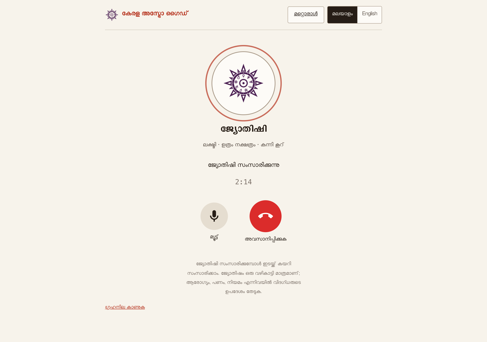
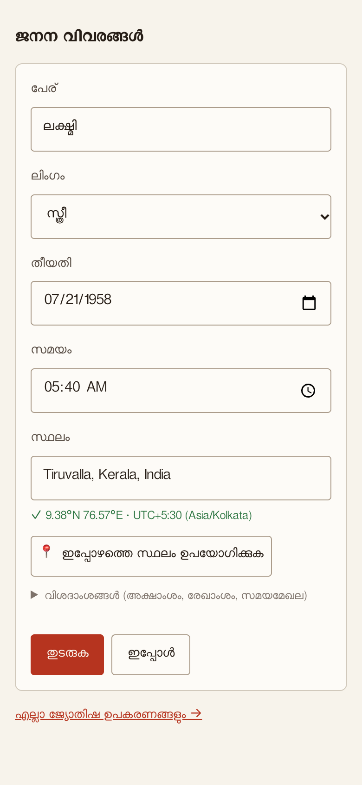
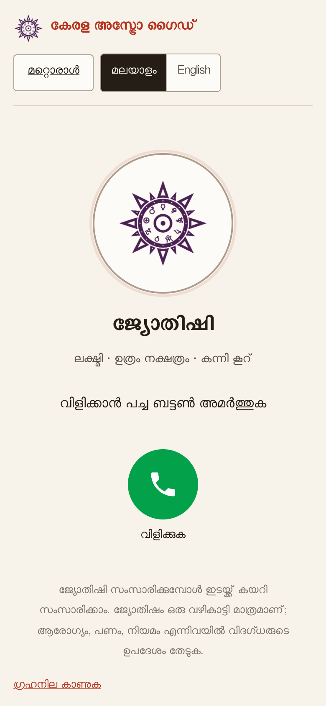
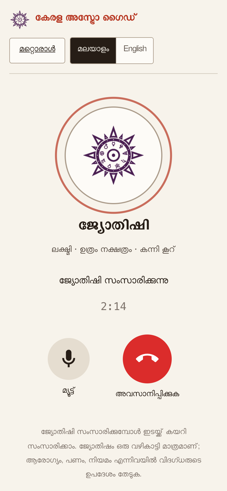

# Kerala Astro Guide

A free, open-source web app for Kerala-style (Malayalam) astrology, live at
**https://astro.flowsxr.com**. All calculations run in your browser: positions come from the Swiss
Ephemeris compiled to WebAssembly. Data leaves your device only when you search for a place
(OpenStreetMap) or start a voice call with the astrologer (Google Gemini, see below).

Bilingual interface (Malayalam / English), phone-friendly.

## Features

- **Horoscope (ജാതകം):** time and panchangam values, Malayalam and Saka dates, sphutas, Kerala
  square charts (rasi, navamsa, bhava), Vimshottari dasa with sub-periods, bhava sphuta,
  shadvarga, ashtakavarga (bhinna and samudaya, with the classical samudaya analyses as numbers),
  karthru dosham stars, Kalachakra dasa, Parashari and other varga charts, KP sub-lords,
  printable sheet.
- **Marriage matching (വിവാഹപൊരുത്തം):** the ten nakshatra poruthams computed from the
  traditional rules, papasamyam, dasa sandhi and kuja dosham comparison.
- **Prashnam (പ്രശ്നം):** prashna sphutas, tamboolam, guna-dosham, sutrams, prashna shadvarga,
  ashtamangalam digits, KP ruling planets.
- **Transits (ഗോചരം):** sign ingress times for any planet and date range; transit positions
  from the birth sign.
- **Muhurtham:** panchanga shuddhi calendar and a daily panchangam (lagna changes, kalahora,
  muhurthas, upagraha kalam, guna-dosham, mrityu dosham checks).
- **Tools:** Malayalam to English date converter, star-only porutham, rasi pramanam.
- Settings for ayanamsa (Lahiri, Raman, KP, Chandrahari and more), node type, house system,
  sunrise definition, year length and Kollam era convention.

This edition shows calculations, tables and charts only. It does not include interpretive texts.

## Talk to the astrologer

**https://astro.flowsxr.com/#/ask**: a simple, large-type screen made for elders.

<table>
  <tr>
    <td width="50%"></td>
    <td width="50%"></td>
  </tr>
  <tr>
    <td align="center">ജനന വിവരങ്ങൾ: name, date, time, and the place picked by name</td>
    <td align="center">ജ്യോതിഷിയുമായി സംസാരിക്കുന്നു: the call in progress</td>
  </tr>
</table>

<p align="center">
  
  
  
</p>

`#/ask` is a simple, large-type screen for elders: pick or enter a person, then press the green
button for a live voice call with an AI astrologer (Malayalam by default, English optional).
You can interrupt him at any time, like a phone call. The chart is computed in the browser; the
facts (positions, nakshatra, dasa/apahara dates, today's transits) go to a serverless function
(`api/live-token.js`) that builds the whole call setup and locks it into a short-lived,
single-use Gemini Live token. The browser then streams audio to Gemini directly; the API key
never leaves the server.

Environment variables (Vercel project settings, or `.env.local` for `npm run dev`):

- `GEMINI_API_KEY` (required)
- `LIVE_MODEL` (optional, default `gemini-3.8-live`)
- `LIVE_VOICE` (optional, default `Charon`; any Gemini prebuilt voice)
- `FAMILY_CODE` (optional): when set, calls only work after opening `/#/ask?k=<FAMILY_CODE>`
  once on a device, so strangers cannot spend your quota.

## Development

```sh
npm install
npm run dev             # http://127.0.0.1:5180
npm test                # Node tests (calculations against the reference tables)
npm run build:public    # production build into dist/ (same as the Vercel build)
npm run check-public    # build and verify the public bundle
```

Requires Node 20.6 or later. No framework: Vite and plain ES modules.

### Layout

- `src/engine/` pure calculation code (Swiss Ephemeris instance in, plain objects out).
- `src/modules/` one folder per screen; `src/components/` shared UI (birth form, Kerala chart).
- `public/open/reference.json` traditional reference tables (names, nakshatra attributes, dasa
  years, ashtakavarga and other classical lookup tables).
- `public/open/places.json` place search data from GeoNames.
- `src/private-stub/` empty stand-ins for optional text modules imported as `@private/...`.

## Licence and attributions

- Code: GNU Affero General Public License v3.0 or later, see [LICENSE](LICENSE).
- [Swiss Ephemeris](https://www.astro.com/swisseph/) by Astrodienst AG, used under the AGPL
  through [sweph-wasm](https://github.com/ptprashanttripathi/sweph-wasm). Ephemeris files in
  `public/ephe/` are Astrodienst's.
- Place data: [GeoNames](https://www.geonames.org/), CC BY 4.0.
- Malayalam fonts by Swathanthra Malayalam Computing and other authors, under the SIL Open Font
  License or the GPL with font exception; see
  [public/fonts/FONT-LICENSES.txt](public/fonts/FONT-LICENSES.txt).

## Disclaimer

The results follow traditional astrological rules and are offered for cultural and educational
use. They are not scientific predictions; do not rely on them for medical, legal, financial,
marriage or other important decisions. No warranty.

Independent project, not affiliated with or endorsed by the makers of any other astrology software.
